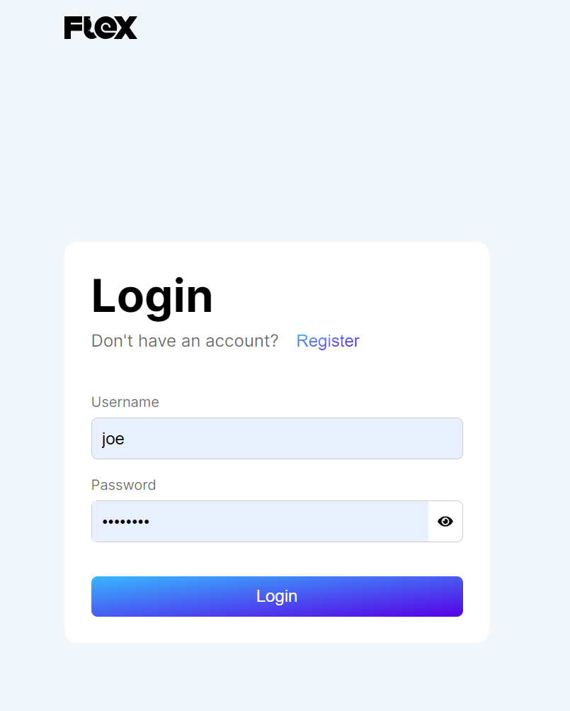
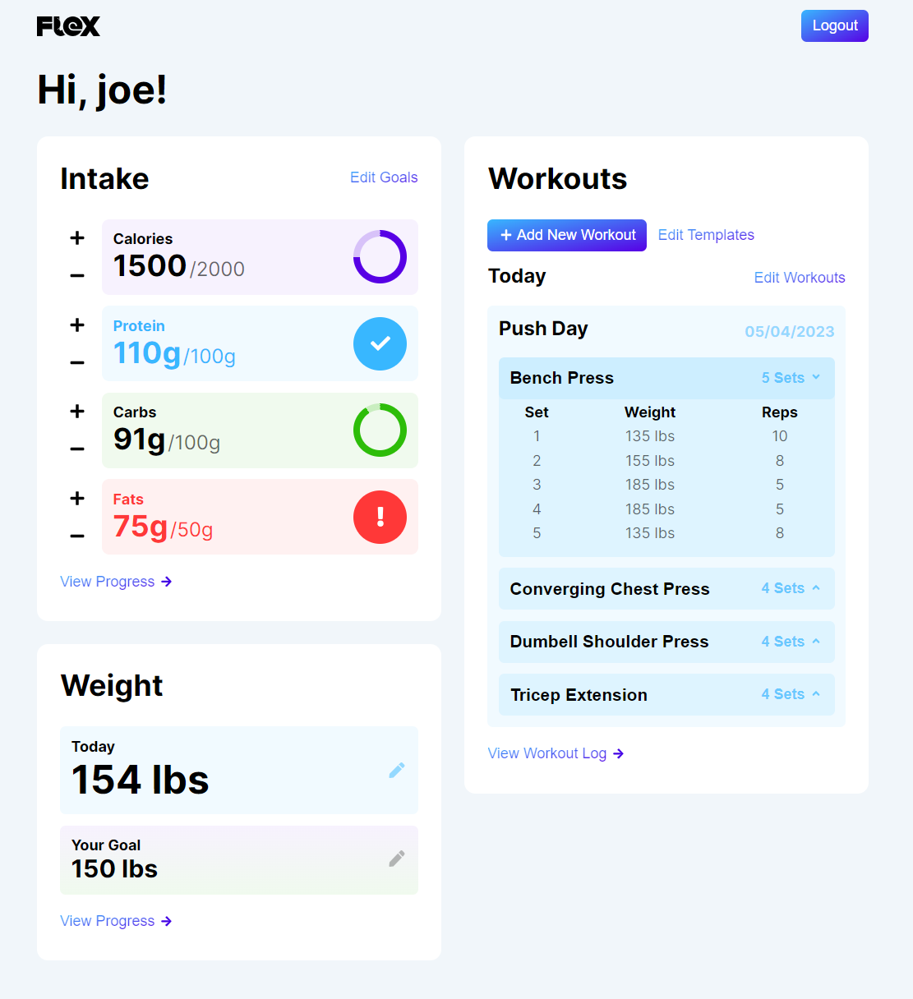
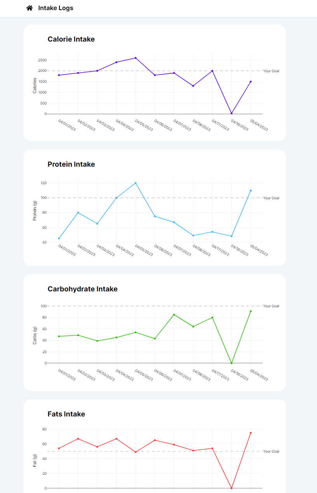

# Flex
## Introduction
Flex is a Spring Boot based web-application which allows users to track workouts, daily intake, and body weight. Users will also be able to set specific goals for each of the elements that they are able to track and see their progress over time. This will solve the dilemma of needing multiple apps to track your overall fitness by providing one website that allows you to track everything. 

## Technology/Frameworks
Front-end: React.  
Back-end: Spring Boot and MySQL.

## Credits
Flex was developed as a project for the University of Pittsburgh's CS 1530 Software Engineering course. This application was developed by:
* Tyler Courtney
* Matthew Guiddy
* Paolo Hidalgo
* Pierce Martin
* Owen Wurst

## Our App
When launching this app, the user is first taken to a login page where they can sign in or register a new user. When new users are registered, their information is added to the database and they are automatically signed in.
 
    

        
    

 
After signing in, users are taken to the home page, where they are shown the current days macronutrient intakes, weight and the current days workout. Users can set/update macro goals and weight goals on this page, both of which are updated in the database. From this page users can log the current days weight or macro intake, and they can also navigate to the page for logging a workout.
 
    

        
    

 
A user can navigate to the intake or weight history pages by clicking "View Progress". These pages both graph the daily intake of the user over time with a line to show the users set goal.
 
    

        
    
